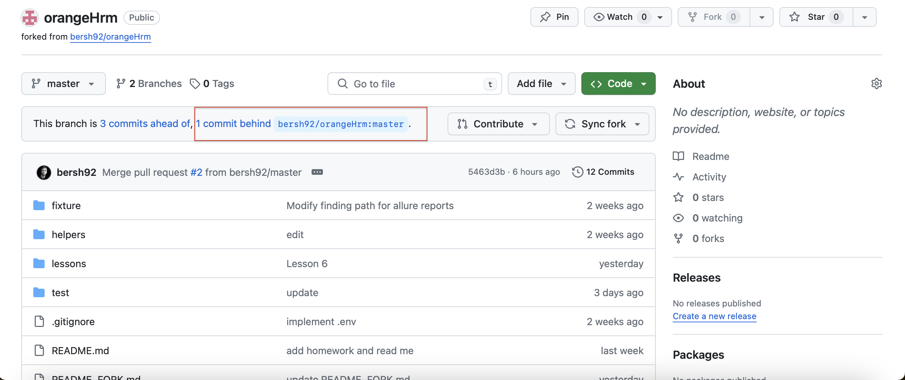
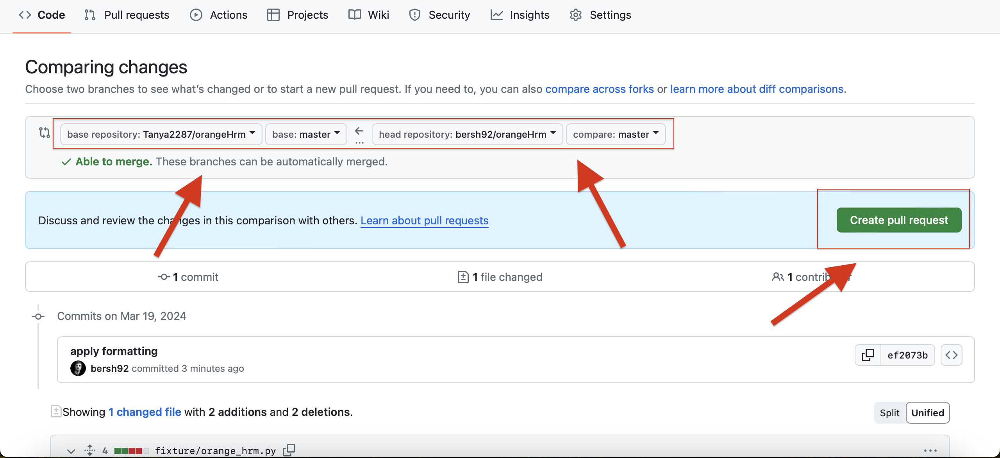
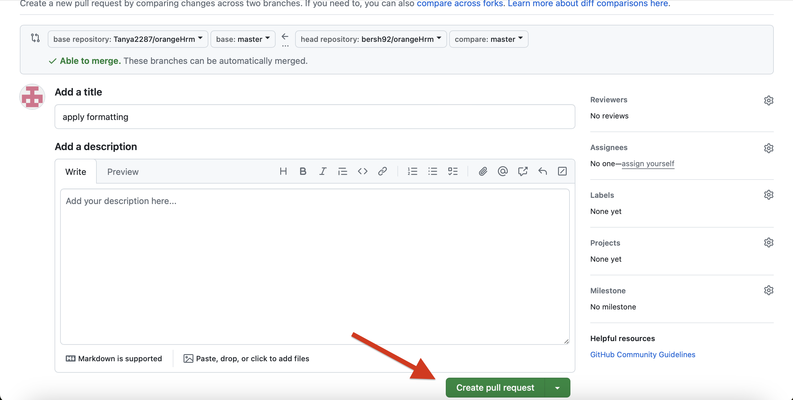
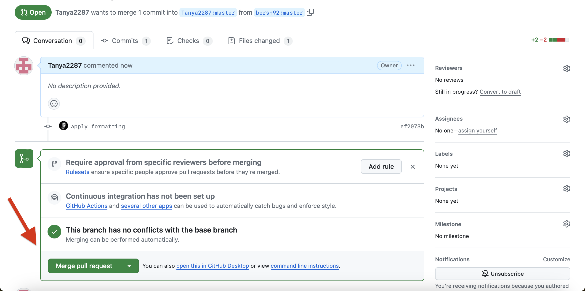
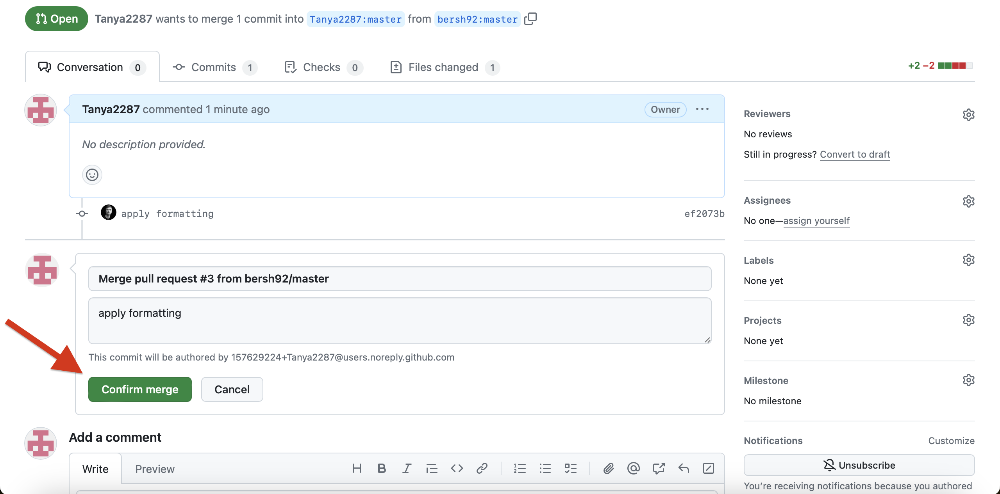

# Course Repository Setup Instructions

Follow these instructions to set up your project environment correctly for receiving updates and managing your work.

## Step 1: Create a GitHub Account

1. Visit [GitHub](https://github.com/) and sign up for a new account if you do not already have one.
2. Follow the prompts to complete your account setup.

## Step 2: Fork the Repository

1. Go to the [original course repository](https://github.com/bersh92/orangeHrm).
2. Click on the **Fork** button at the top right corner of the page. This creates a personal copy of the repository in your GitHub account.

## Step 3: Add Your Instructor as a Collaborator

1. In your forked repository, navigate to **Settings** > **Manage access** > **Invite a collaborator**.
2. Search for your instructor's GitHub username: "bersh92" and send the invitation.

## Step 4: Configure Your Local Repository

Since you've already cloned the repository, you'll need to update your local repository's remote URL to point to your forked version on GitHub.

1. Open your project in PyCharm.
2. Open the integrated terminal in PyCharm via `View` > `Tool Windows` > `Terminal`.
3. Execute the following command in the terminal to change the remote URL to your fork:

    ```bash
    git remote set-url origin <Your-Forked-Repository-URL>
    ```

    Replace `<Your-Forked-Repository-URL>` with the URL of your forked repository on GitHub.

4. Verify the remote URL has been updated correctly by executing:

    ```bash
    git remote -v
    ```

    This command should now show the URL of your fork as the remote for `origin`.

## Step 5: Add the Original Repository as an Upstream Remote

To receive updates from the original course repository, configure it as an upstream remote:

1. In the PyCharm terminal, add the original repository as an upstream remote:

    ```bash
    git remote add upstream <Original-Repository-URL>
    ```

    Replace `<Original-Repository-URL>` with the URL of the original repository.

2. Verify the upstream remote has been added by executing:

    ```bash
    git remote -v
    ```

    You should see the original repository listed as `upstream`.

## Step 6: Pull Updates from the Original Repository

To keep your project synchronized with the original repository, follow these steps whenever updates are announced:

1. **Switch to Your Master Branch**: Ensure you're on your master branch.
    ```bash
    git checkout master
    ```

2. **Commit Any Uncommitted Changes**: Before pulling updates, make sure all your changes are committed. Check for any highlighted (uncommitted) files within your IDE. If any are found:
   - **Commit the Changes**: If you wish to keep these changes, commit them.
   - **Rollback Unwanted Changes**: If the changes are unnecessary, discard them.

3. **Fetch the Updates from Upstream**:
    ```bash
    git fetch upstream
    ```

4. **Merge the Updates into Your Master Branch**:
    ```bash
    git merge upstream/master
    ```

5. **Resolve Conflicts if Necessary**: If you encounter merge conflicts:
   - A message will indicate which files have conflicts. 
   - Navigate to your project's main folder, right-click, select `Git`, and then `Resolve Conflicts` to view the conflicted files.
   - Open each conflicted file one by one to resolve the conflicts by choosing to keep your changes or apply the updates.

Repeat these steps to ensure your project is always up to date with the latest changes from the original repository.


---

By following these instructions, you'll ensure that your local development environment is correctly set up to work on assignments and stay up-to-date with course materials.
Also there is the way how to pull updates using GitHub UI






